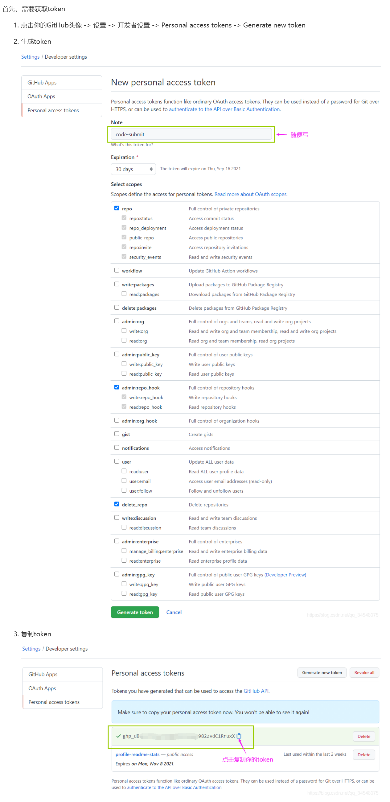
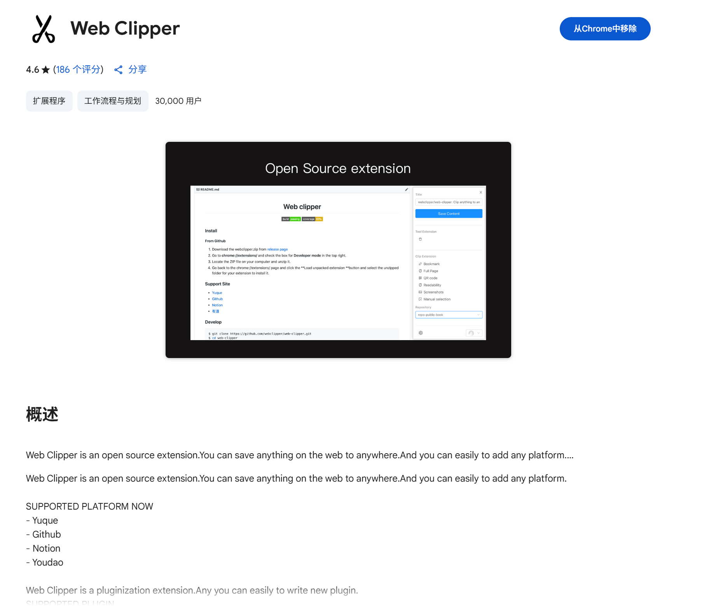
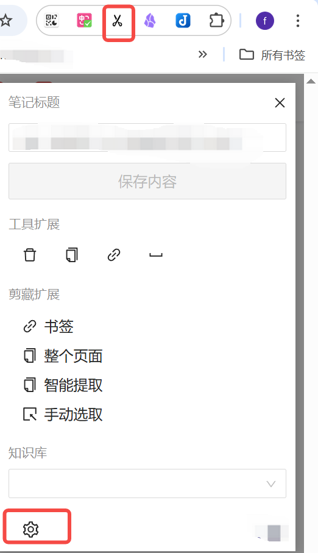
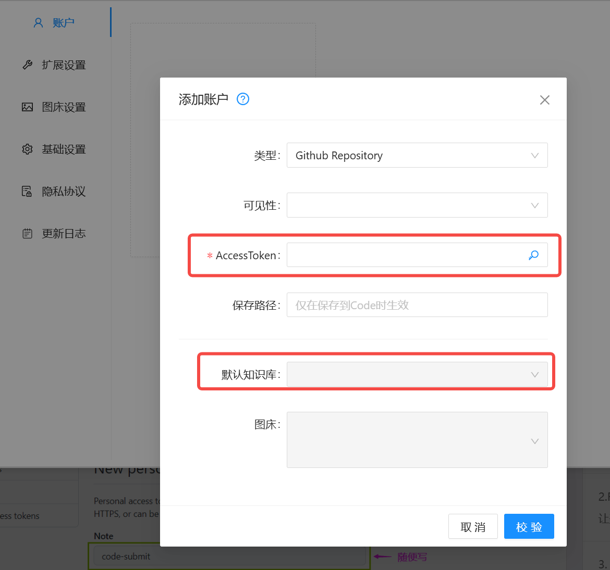
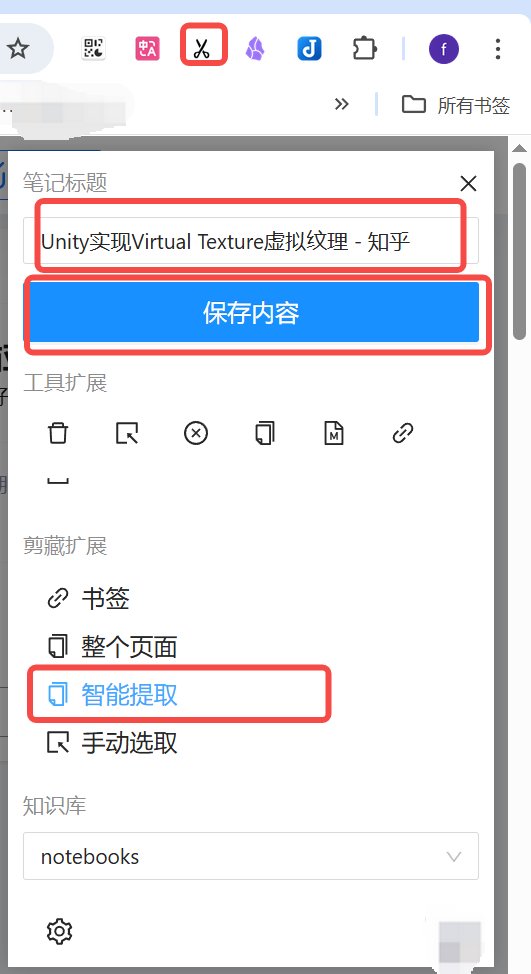
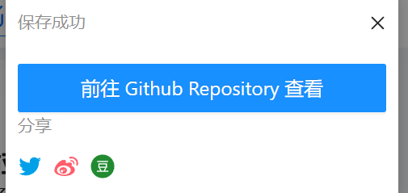
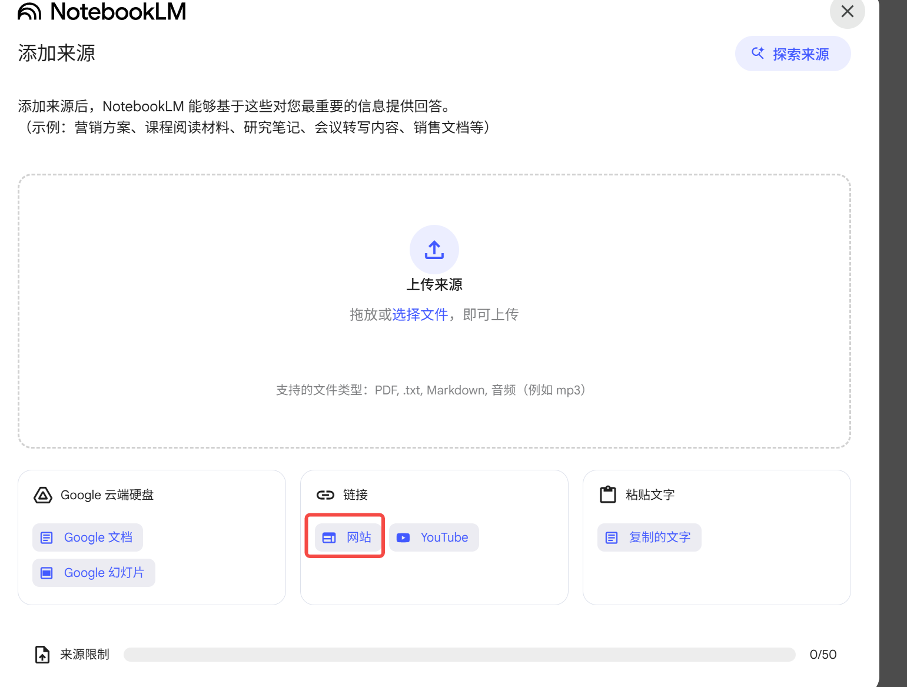
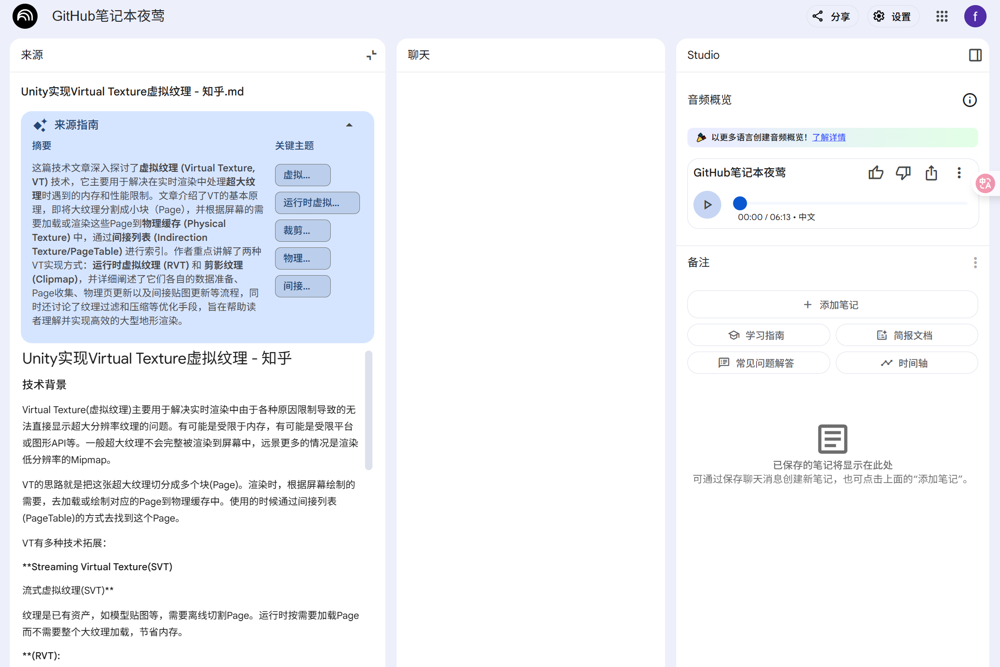

## 目标
我们经常在浏览网页的时候要收藏一下网页内容，并且消化这些内容，这里面介绍如何一套方案帮我们实现：
1. 借助github库 + web clipper网页插件自动保存文章
2. 把第一步形成的网页链接接入google的 notebooklm，自动生成语音博客，学习指南等

### 如何保存网页实现
- 登陆你的github账号，获取方法可以参考 [GitHub使用Personal access token](https://www.cnblogs.com/chenyablog/p/15397548.html) 如图：
- 在浏览器上安装
- 点击设置 web clipper：
- 设置github token的默认知识库：

### 阶段性验证结果：
- 在完成上面的步骤之后，你就可以保存到你要收藏的网页内容到github啦： 

## 如何把你保存的网页导入notebooklm
- 登陆 https://notebooklm.google.com/ 大陆用户自备梯子
-  用网站导入的方式，填写你保存的github的文章的地址

## 享受时刻：

## 备注：
- 有些时候notebooklm 在导入 url的时候，如果url的内容过于复杂（有可能是自身的bug）会失败，你可以直接选择你github库的上的文章下载到本地，再上传到notebooklm上去
- 亲自测试markdown文件导入notebooklm的成功率要远高于pdf，所以现阶段成功率最高的步骤： 网页内容 用webclipper 保存成markdown文件到 github之后，用githubdesktop更新到本地然后上传notebooklm
- 这套方案是灵活的，你完全可以把webclipper 保存的内容，下载到本地以后，用其他知识库来读取

  